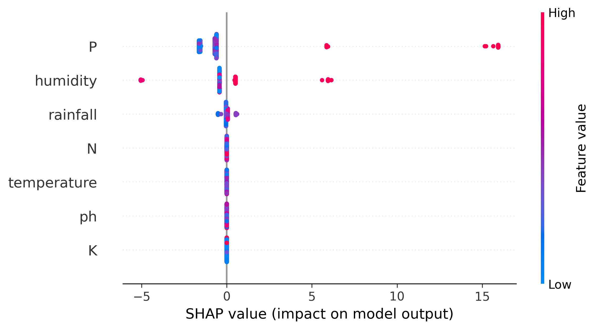
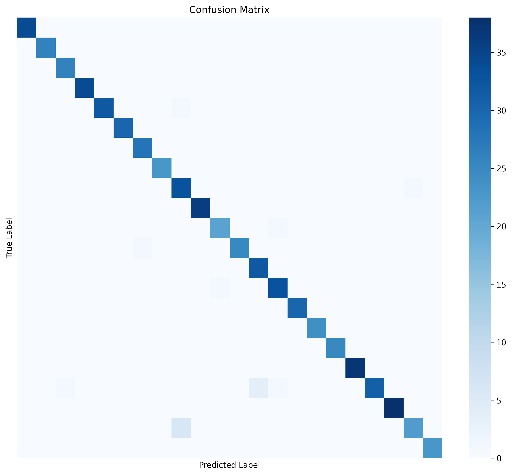
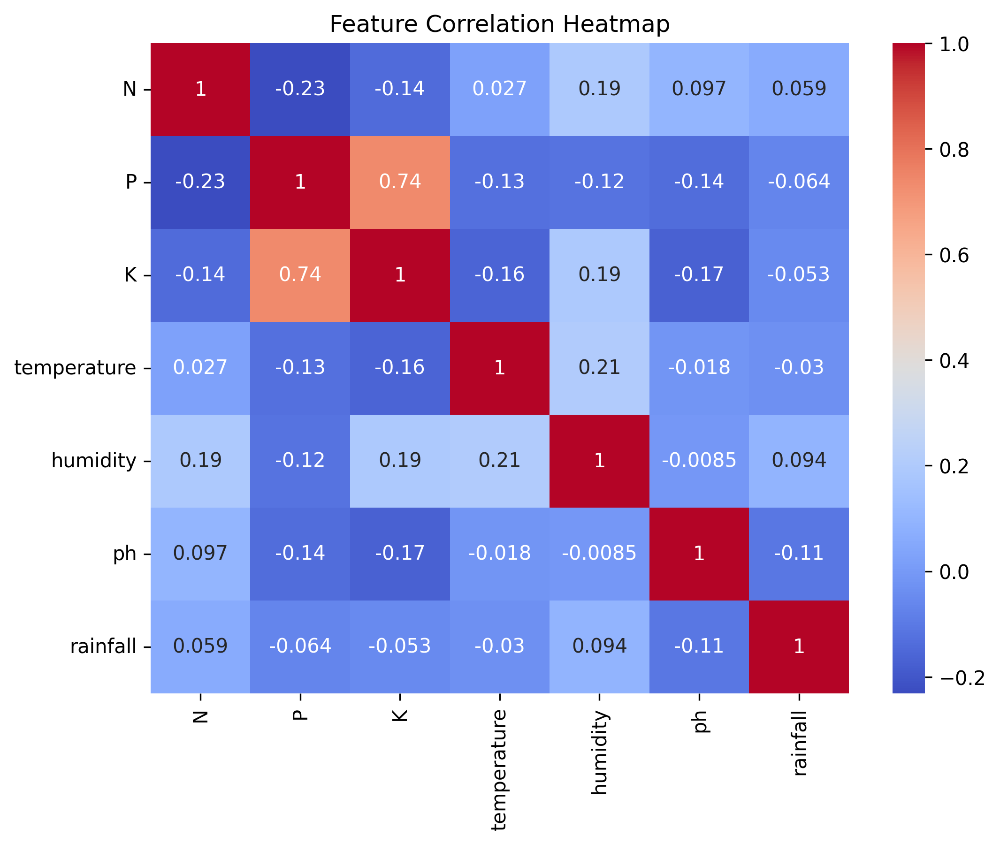

<div align="center">

# 🌾 KRISHI.AI

### Explainable AI-Powered Crop Recommendation System

**Machine Learning • Explainable AI • Counterfactual Analysis • Streamlit • Cloud Deployment**

<br>

[](https://www.python.org/)
[](https://streamlit.io/)
[](https://lightgbm.readthedocs.io/)
[](https://scikit-learn.org/)
[](https://shap.readthedocs.io/)
[](https://render.com/)

<br><br>

<a href="https://krishi-ai-crop-recommendation.onrender.com/">
  
</a>

<br><br>

**Make smarter crop decisions using data-driven machine learning — with explanations, not just predictions.**

</div>

---

## ✨ What is KRISHI.AI?

**KRISHI.AI** is an interactive machine learning system that recommends a suitable crop based on **soil nutrients and environmental conditions**.

Unlike a traditional black-box prediction system, KRISHI.AI combines **machine learning with Explainable AI (SHAP)** to provide insight into the factors influencing a prediction.

The application also includes **what-if / counterfactual analysis**, allowing users to explore how changing agricultural conditions can lead to different crop recommendations.

### 🌱 In one sentence

> **KRISHI.AI transforms agricultural parameters into an interpretable crop recommendation through Machine Learning + Explainable AI.**

---

## 🚀 Live Application

<div align="center">

### 🌐 [Launch KRISHI.AI →](https://krishi-ai-crop-recommendation.onrender.com/)

Try the deployed application directly in your browser.

</div>

---

## 🧭 Navigation

<div align="center">

[Overview](#-overview) •
[Features](#-key-features) •
[Workflow](#-system-workflow) •
[Dataset](#-dataset) •
[Models](#-machine-learning-models) •
[Explainability](#-explainable-ai) •
[Setup](#-run-locally) •
[Deployment](#-deployment) •
[Structure](#-project-structure) •
[Future Scope](#-future-scope)

</div>

---

# 🎯 Overview

Agricultural productivity depends on multiple interacting factors including:

* Soil nutrients
* Temperature
* Humidity
* Soil pH
* Rainfall

Selecting an appropriate crop requires considering these conditions together.

KRISHI.AI provides a machine-learning-driven approach that analyzes these parameters and recommends a crop based on patterns learned from agricultural data.

The system goes one step further by providing **model explanations and what-if analysis**, making the prediction easier to understand.

---

# ✨ Key Features

<table>
<tr>
<td width="50%">

### 🌾 Intelligent Crop Recommendation

Predicts a suitable crop using seven agricultural and environmental parameters.

</td>

<td width="50%">

### 🏆 Model Comparison

Evaluates multiple classification algorithms and compares their performance.

</td>
</tr>

<tr>
<td width="50%">

### 🔍 Explainable AI

Uses SHAP to analyze feature contributions behind model predictions.

</td>

<td width="50%">

### 🤔 What-If Analysis

Explore how modifying agricultural conditions can influence crop recommendations.

</td>
</tr>

<tr>
<td width="50%">

### 🎛️ Interactive Dashboard

Users can modify farm conditions through an interactive Streamlit interface.

</td>

<td width="50%">

### ☁️ Cloud Deployment

The application is deployed as a publicly accessible web application using Render.

</td>
</tr>
</table>

---

# 📊 Input → Intelligence → Recommendation

<div align="center">

```text
┌────────────────────────────────────────────┐
│           🌱 FARM CONDITIONS               │
├────────────────────────────────────────────┤
│ Nitrogen (N)                               │
│ Phosphorus (P)                            │
│ Potassium (K)                             │
│ Temperature                               │
│ Humidity                                   │
│ Soil pH                                    │
│ Rainfall                                   │
└──────────────────────┬─────────────────────┘
                       │
                       ▼
┌────────────────────────────────────────────┐
│          🤖 MACHINE LEARNING               │
│                                            │
│  Decision Tree     Naive Bayes             │
│  KNN               Random Forest           │
│  LightGBM                                   │
│                                            │
│       Performance Comparison                │
└──────────────────────┬─────────────────────┘
                       │
                       ▼
┌────────────────────────────────────────────┐
│            🌾 CROP PREDICTION              │
│                                            │
│        Recommended Crop                   │
│        Prediction Confidence              │
└──────────────────────┬─────────────────────┘
                       │
             ┌─────────┴─────────┐
             ▼                   ▼
┌────────────────────┐  ┌────────────────────┐
│ 🔍 SHAP EXPLAINER  │  │ 🤔 WHAT-IF ANALYSIS│
│                    │  │                    │
│ Feature            │  │ Change N / K /     │
│ Contributions      │  │ Rainfall and      │
│                    │  │ observe outcomes   │
└────────────────────┘  └────────────────────┘
```

</div>

---

# 🧠 Machine Learning Models

KRISHI.AI evaluates multiple classification algorithms:

| Model                  | Purpose                          |
| ---------------------- | -------------------------------- |
| 🌳 Decision Tree       | Rule-based classification        |
| 📈 Naive Bayes         | Probabilistic classification     |
| 📍 K-Nearest Neighbors | Similarity-based prediction      |
| 🌲 Random Forest       | Ensemble tree-based learning     |
| ⚡ LightGBM             | Gradient boosting classification |

The application compares model performance on the test set and selects the highest-performing model for prediction.

---

# 🔬 System Workflow

```text
                 ┌───────────────────────┐
                 │   Crop Dataset        │
                 └───────────┬───────────┘
                             │
                             ▼
                 ┌───────────────────────┐
                 │ Data Preparation      │
                 └───────────┬───────────┘
                             │
                             ▼
                 ┌───────────────────────┐
                 │ Train-Test Split      │
                 └───────────┬───────────┘
                             │
                             ▼
              ┌──────────────────────────────┐
              │     Model Training           │
              │                              │
              │ DT │ NB │ KNN │ RF │ LGBM    │
              └──────────────┬───────────────┘
                             │
                             ▼
                 ┌───────────────────────┐
                 │ Model Comparison      │
                 └───────────┬───────────┘
                             │
                             ▼
                 ┌───────────────────────┐
                 │ Best Model            │
                 └───────────┬───────────┘
                             │
                ┌────────────┴────────────┐
                ▼                         ▼
      ┌──────────────────┐      ┌──────────────────┐
      │ Crop Prediction  │      │ SHAP Explanation │
      └────────┬─────────┘      └────────┬─────────┘
               │                         │
               └────────────┬────────────┘
                            ▼
                 ┌───────────────────────┐
                 │ Streamlit Dashboard  │
                 └───────────┬───────────┘
                             │
                             ▼
                    🌾 Crop Recommendation
```

---

# 🔍 Explainable AI

One of the main goals of KRISHI.AI is to move beyond:

> **"The model says this crop."**

and instead answer:

> **"Why did the model recommend this crop?"**

### SHAP

KRISHI.AI uses **SHAP (SHapley Additive exPlanations)** to analyze the contribution of the input features.

The explanation layer helps identify the relative influence of:

* Nitrogen
* Phosphorus
* Potassium
* Temperature
* Humidity
* Soil pH
* Rainfall

### Why Explainability Matters

Explainable AI helps make machine learning predictions:

**More transparent → More interpretable → Easier to analyze**

---

# 🤔 Counterfactual / What-If Analysis

KRISHI.AI allows users to investigate alternative outcomes.

For example:

```text
Current Farm Conditions
          │
          ▼
   Recommended Crop
          │
          ▼
 Change a Condition
  ┌───────┼────────┐
  ▼       ▼        ▼
Rainfall Nitrogen Potassium
  │       │        │
  └───────┼────────┘
          ▼
    New Prediction
```

This provides an intuitive way to explore:

**"What could happen if one agricultural condition changes?"**

---

# 🌱 Dataset

The system uses a crop recommendation dataset containing agricultural and environmental measurements.

### Features

| Feature       | Description        | Unit  |
| ------------- | ------------------ | ----- |
| `N`           | Nitrogen content   | kg/ha |
| `P`           | Phosphorus content | kg/ha |
| `K`           | Potassium content  | kg/ha |
| `temperature` | Temperature        | °C    |
| `humidity`    | Relative humidity  | %     |
| `ph`          | Soil pH            | pH    |
| `rainfall`    | Rainfall           | mm    |
| `label`       | Crop class         | —     |

---

# 📈 Results

The project achieves approximately **98–99% classification accuracy** on the crop recommendation task, depending on the evaluated model configuration and execution.

The application also provides a direct comparison of the candidate models so users can see how the algorithms perform against each other.

> **Note:** Performance shown in the deployed application is generated during execution rather than hard-coded into the interface.

---

# 🖥️ Application Preview

You can add screenshots from your repository here.

### 🌾 Crop Recommendation Dashboard

<p align="center">
  
</p>

### 📊 Model & Data Analysis

<p align="center">
  
  &nbsp;&nbsp;
  
</p>

---

# 🛠️ Technology Stack

<div align="center">

| Category         | Technologies           |
| ---------------- | ---------------------- |
| Language         | Python                 |
| Data Processing  | Pandas, NumPy          |
| Machine Learning | Scikit-learn, LightGBM |
| Explainability   | SHAP                   |
| Visualization    | Matplotlib             |
| Interface        | Streamlit              |
| Version Control  | Git, GitHub            |
| Deployment       | Render                 |

</div>

---

# ⚙️ Run Locally

## 1. Clone the Repository

```bash
git clone https://github.com/Bhxvyx05/KRISHI.AI-Crop-Recommendation.git
cd KRISHI.AI-Crop-Recommendation
```

## 2. Create a Virtual Environment

### Windows

```bash
python -m venv venv
venv\Scripts\activate
```

### macOS / Linux

```bash
python3 -m venv venv
source venv/bin/activate
```

## 3. Install Dependencies

```bash
pip install -r requirements.txt
```

## 4. Run Streamlit

```bash
streamlit run app.py
```

Open the local URL displayed by Streamlit in your browser.

---

# ☁️ Deployment

KRISHI.AI is deployed using **Render**.

### Deployment Architecture

```text
GitHub Repository
        │
        ▼
      Render
        │
        ▼
Install Python Dependencies
        │
        ▼
Run Streamlit Application
        │
        ▼
   Public Web URL
```

### 🌐 Live Demo

<div align="center">

<a href="https://krishi-ai-crop-recommendation.onrender.com/">


</a>

</div>

---

# 📂 Project Structure

```text
KRISHI.AI-Crop-Recommendation/
│
├── 📄 app.py
├── 📊 Crop_recommendation.csv
├── 📓 crop_recommendation_system.ipynb
├── 📦 requirements.txt
├── 📜 README.md
├── ⚖️ LICENSE
│
└── 📁 images/
    ├── confusion_matrix.png
    ├── correlation_heatmap.png
    ├── feature_importance_shap.png
    ├── roc_curves.png
    └── ...
```

---

# ⚠️ Limitations

* Model recommendations depend on the quality and representativeness of the dataset.
* The current system does not directly consume real-time weather data.
* Agricultural conditions can differ significantly across regions.
* Dataset-driven recommendations should be treated as decision support rather than a substitute for expert agronomic advice.
* Regional and seasonal adaptation would improve real-world applicability.

---

# 🔮 Future Scope

### 🌦️ Real-Time Intelligence

Integrate live weather and environmental APIs.

### 📡 IoT Integration

Connect soil sensors for real-time nutrient and moisture readings.

### 🗺️ Region-Aware Recommendations

Incorporate geographic and regional agricultural patterns.

### 📱 Mobile Application

Extend the system to Android and iOS platforms.

### 🗣️ Multi-Language Support

Provide recommendations in regional languages for wider accessibility.

### 💧 Smart Irrigation

Extend the platform toward irrigation and water-management recommendations.

### 🌱 Fertilizer Recommendation

Use the same intelligent framework for nutrient and fertilizer suggestions.

### 📈 Yield Prediction

Move beyond crop selection toward expected yield forecasting.

---

# 🎓 Project Objective

KRISHI.AI demonstrates how **Machine Learning, Explainable AI, Interactive Visualization, and Cloud Deployment** can be combined to build a practical agricultural decision-support system.

The project focuses on three core principles:

```text
        PREDICT
           +
        EXPLAIN
           +
        EXPLORE
           =
      KRISHI.AI
```

---

# 👩‍💻 Author

<div align="center">

### Bhavya Dhingra

Machine Learning • Artificial Intelligence • Data Science

</div>

---


